# **Takım İsmi**

YZTA Takım 17

# Ürün İle İlgili Bilgiler

## Takım Elemanları

- Melis Can: Product Owner
- Eda Kaygulu: Scrum Master
- Rüya Sena Demirci, Furkan Emre İnce, Musa Barutçu: Team Member/Developer

## Ürün İsmi

CarbOn

## Ürün Açıklaması

- CarbOn, günlük hayattaki ulaşım, enerji tüketimi ve alışveriş gibi alışkanlıklarımızın doğaya olan etkisini fark etmemizi sağlayan akıllı bir sürdürülebilirlik uygulamasıdır. Günümüzde karbon ayak izimizi anlık olarak görüp bunu azaltmaya çalışmak oldukça zor. CarbOn ile kullanıcıların günlük aktivitelerini takip ederek çevreye olan etkilerini verilere döküp somutlaştırıyoruz. Arkada çalışan yapay zeka ajanları (Agent) sayesinde de kullanıcının bu etkiyi azaltması için tamamen kendine özel, uygulanabilir tavsiyeler ve rehberlik sunuyoruz. 

## Ürün Özellikleri

- **Tracking Agent (Veri Takibi ve Hesaplama):** Kullanıcının günlük ulaşım tercihlerini (KM) ve fatura detaylarını alarak anlık karbon ayak izini hesaplar.
- **Insight Agent (Trend ve Veri Analizi):** Tüketim alışkanlıklarını analiz eder. Kullanıcının doğaya en çok hangi alanda zarar verdiğini tespit edip bunu anlaşılır ve sade bir metin özetiyle sonuç panelinde gösterir.
- **Coach Agent (Akıllı Koçluk):** Kullanıcının yaşam tarzına uygun, uygulanabilir küçük yeşil görevler ve net öneriler hazırlar. Kullanıcının günlük karbon bütçesini aşmamasını sağlar ve motivasyonunu yüksek tutar.

## Hedef Kitle

- Karbon ayak izini azaltmak ve çevreye katkıda bulunmak isteyenler
- Günlük tüketim ve ulaşım alışkanlıklarını daha düzenli takip etmek isteyen dijital kullanıcılar
- Sürdürülebilir ve yeşil yaşamı hayat tarzı haline getirmek isteyen herkes
- 18 - 60 yaş arası akıllı telefon kullanıcıları

# Sprint 1

- **Backlog düzeni ve Story seçimleri**: İlk sprint olduğu için Trello panomuzu ekibin yazılım tecrübesine ve projenin başlangıç ihtiyaçlarına göre basitçe düzenledik. Bu 2 haftalık süreçte gözümüzü korkutmayacak, rahatça tamamlayabileceğimiz kadar iş seçmeye dikkat ettik. İş takibini kolaylaştırmak için ana hedeflerimizi (Story'leri) daha küçük yapılacak işlere (task'lere) böldük. Panomuzda mavi etiketli kartlar kullanıcı gözünden belirlediğimiz ana istekleri, kırmızı etiketli kartlar ise bunları yapmak için ekibin yapacağı teknik işleri gösteriyor.

- **Daily Scrum**: Takım olarak ilk tanışma ve proje planlama toplantımızı bir araya gelerek sesli/görüntülü olarak gerçekleştirdik. Sonrasındaki süreçte, üyelerin okulları ve kişisel yoğunlukları nedeniyle ortak bir saat bulmak zor olduğundan, Daily Scrum takibini WhatsApp üzerinden yazılı olarak yürütmeye karar verdik. Herkes gün içinde ne yaptığını, ne yapacağını ve bir engeli olup olmadığını gruptan paylaştı. Bu mesajlaşmaların bir örneğini ekran görüntüsü olarak ekledik.
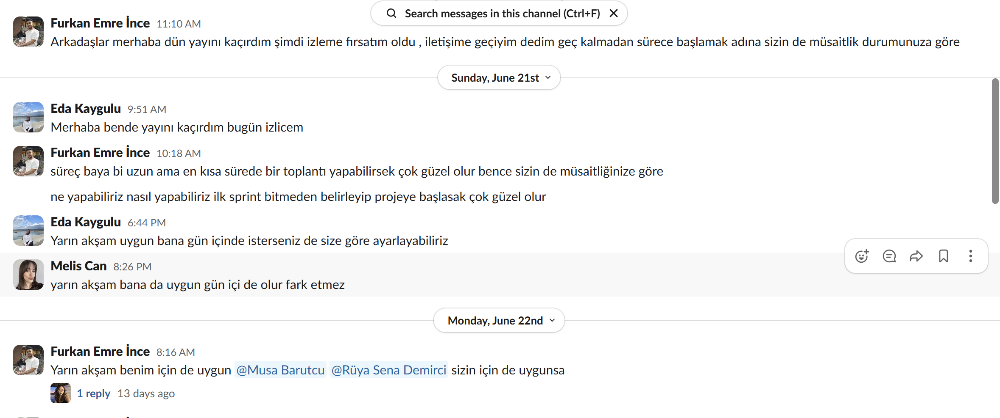
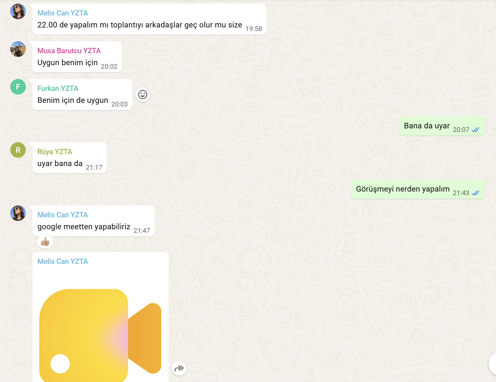
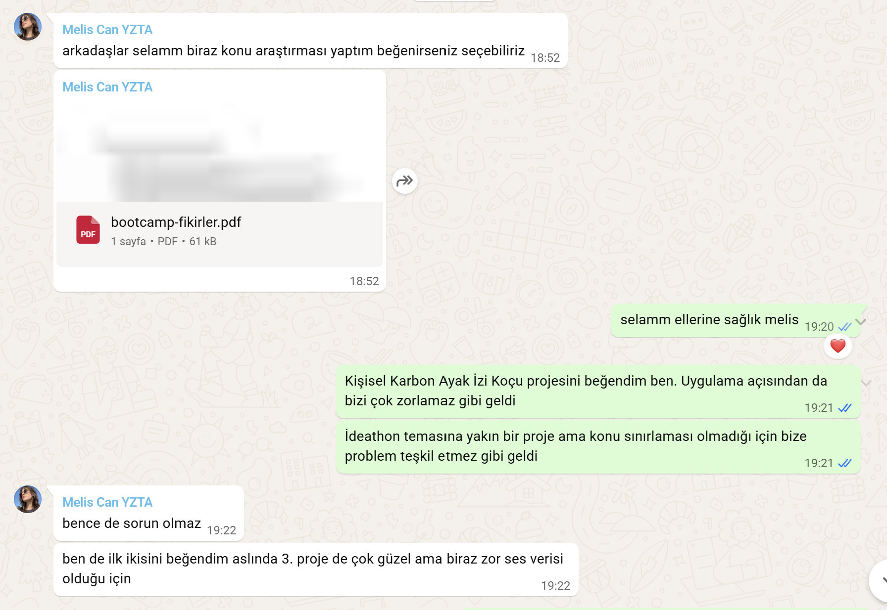
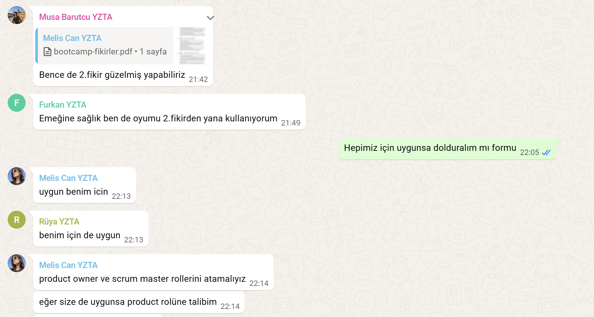
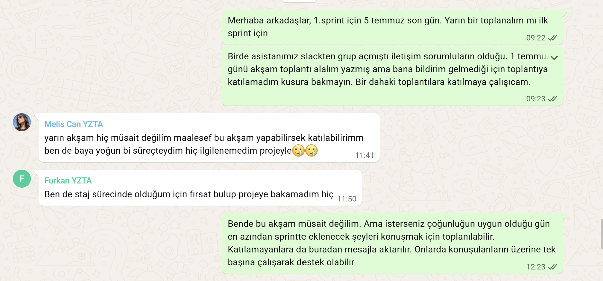

- **Sprint board update**: Sprint boyunca işlerimizi takip ettiğimiz Trello panomuzun ekran görüntüleri:
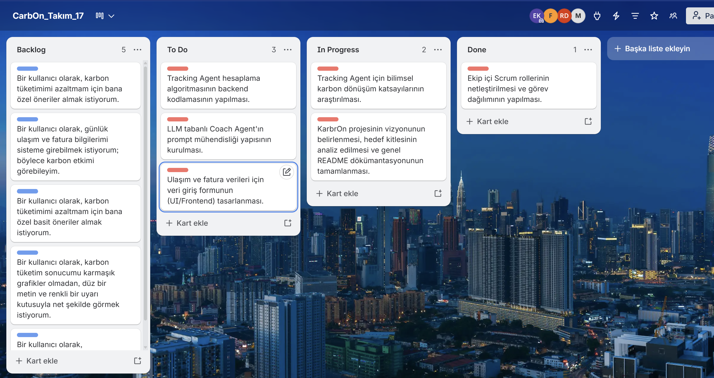
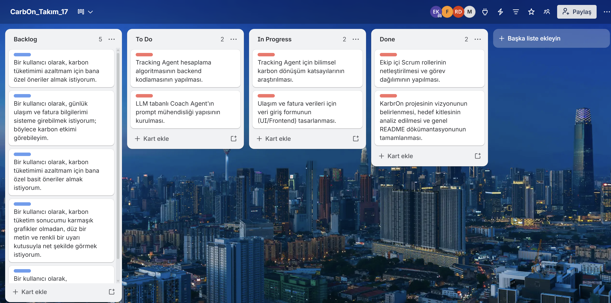

- **Ürün Durumu**: İlk sprinti tamamen projenin teorik altyapısını kurmaya, karbon ayak izi hesaplamalarında kullanacağımız veri setlerini araştırmaya ve uygulamanın mantıksal mimarisini tasarlamaya ayırdık. Bu nedenle bu sprintte henüz somut bir kod çıktısı veya çalışan bir uygulama arayüzü üretilmemiştir.

- **Sprint Review**: Alınan Kararlar: İlk sprint için yaptığımız değerlendirmede, projenin vizyonunu ve Trello panosundaki görev dağılımını planladığımız gibi tamamladığımızı gördük. Tracking Agent için gerekli olan karbon dönüşüm katsayılarını ve bilimsel verileri araştırdık. Ancak kullanıcı arayüzü tasarımı ve backend tarafındaki hesaplama algoritmasının kodlanması, ekibin tasarım ve geliştirme süreçlerine yeni adapte olmasından dolayı bu sprint yetişmedi. Süreci tıkamamak ve aceleye getirmemek adına bu iki teknik görevi bir sonraki sprint'e (Sprint 2) aktarma kararı aldık. Önümüzdeki sprint önceliğimiz bu arayüzü çıkarıp algoritmayı bağlamak olacak. Sprint Review Katılımcıları: Melis Can, Eda Kaygulu, Rüya Sena Demirci, Furkan Emre İnce, Musa Barutçu.

- **Sprint Retrospective:**
- İlk sprintte planlama ve araştırma işlerine çok vakit ayırdığımızı fark ettik; sonraki sprintte kodlama ve tasarıma daha hızlı geçilmesi gerektiğine karar verdik.
- Trello'daki kartları açarken işlerin büyüklüğünü tam kestiremediğimizi gördük. Gelecek sprint planlama toplantısında görev sürelerini daha gerçekçi dağıtacağız.  
- Ekipteki herkesin teknik tecrübesi aynı olmadığı için, önümüzdeki sprint boyunca takıldığımız yerlerde birbirimize daha çok destek olacağımız ortak çalışma saatleri belirleme kararı aldık.

<h2>Sprint 2</h2>

 

<b>Backlog Düzeni ve Story Seçimleri</b>

 

Sprint 2 başında Sprint 1'den kalan iki göreve (Tracking Agent backend ve UI/Frontend tasarımı) öncelik verdik. Ajan mimarisinin çalışır hale gelmesi diğer tüm özelliklere bağlı için backend ve Coach Agent prompt mühendisliği görevlerini sprint başına aldık. 

Kullanıcı perspektifinden uygulamada olması beklenen özellikleri içeren user story'ler (veri girişi, karbon hesaplama ve öneri sistemi) ilk sıraya yerleştirildi. Gamification ve karşılaştırma özellikleri ise temel akış tamamlandıktan sonra eklendi. Story puanları kartlar üzerinde belirtildi ve sprint'in toplam kapasitesi 14 puan olarak ayarlandı.

<b>Daily Scrum</b>

 

Takım olarak Daily Scrum toplantılarını WhatsApp ve çoğunlukla Google Meet üzerinden yürüttük. Aldığımız kararları genellikle Google Meet üzerinden sesli olarak aldık ve fikirlerimizi tartıştık.

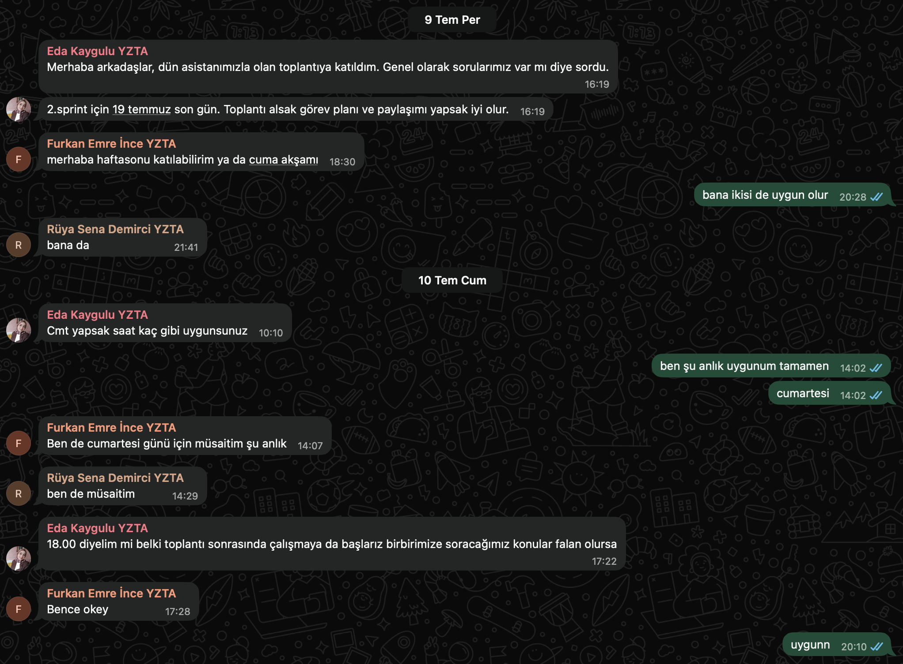
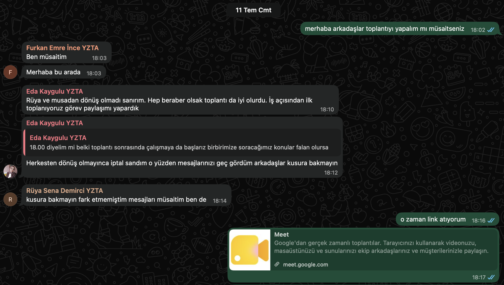
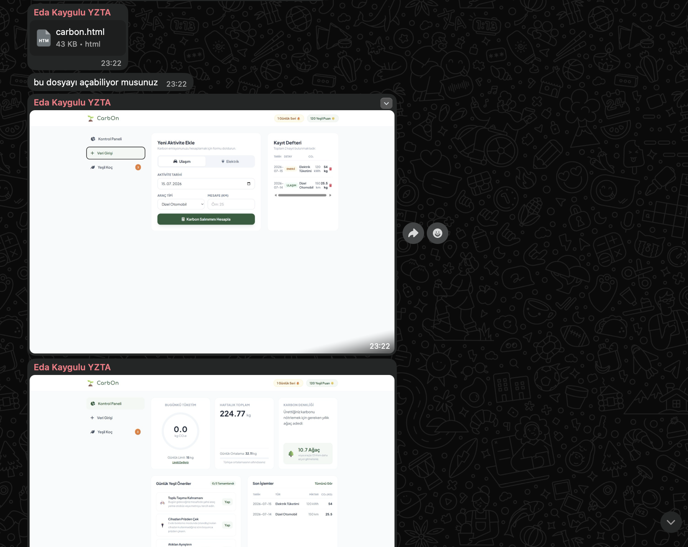
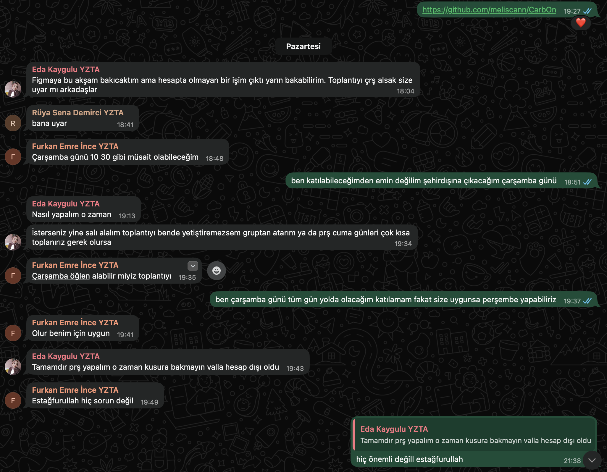
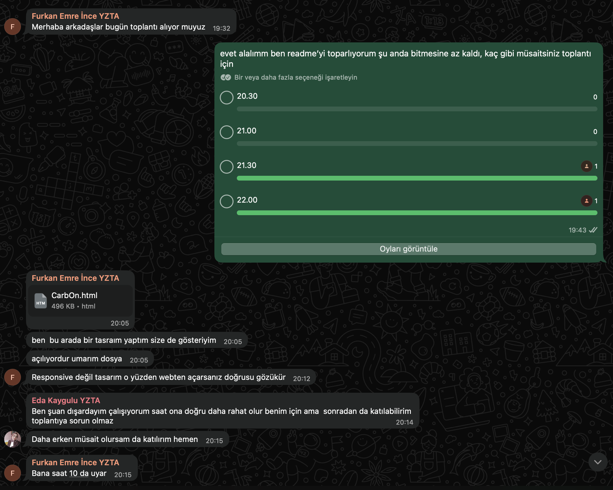
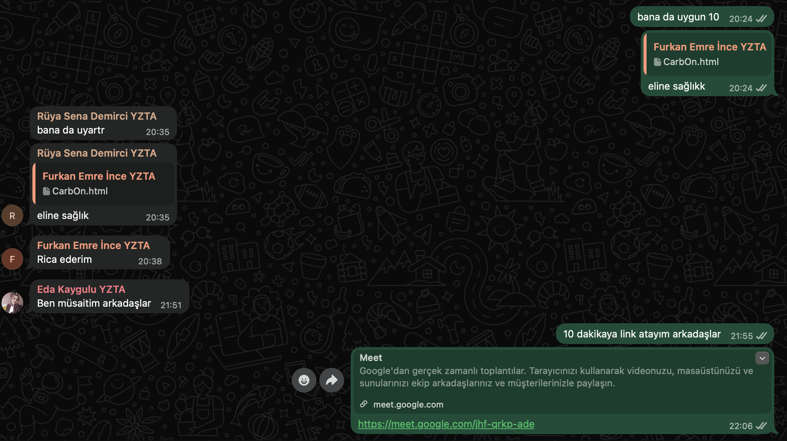

<b>Sprint Board Update</b>

 

Sprint boyunca işlerimizi takip ettiğimiz Trello panomuzun ekran görüntüleri:

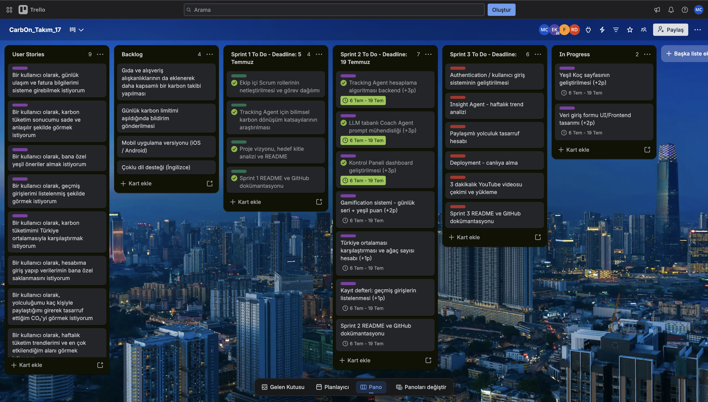
*Sprint ortası ekran görüntüsü*

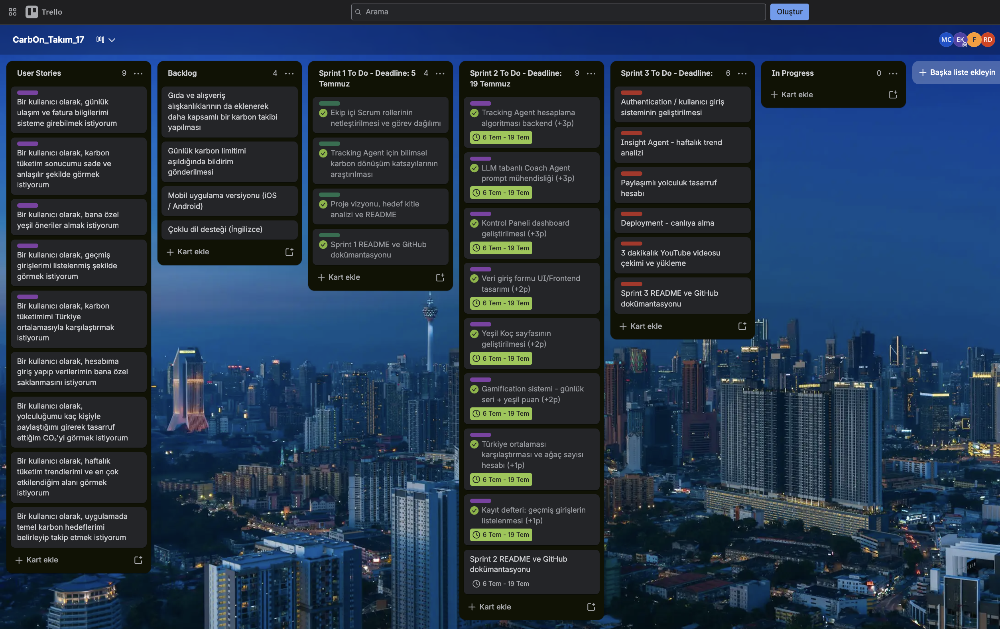
*Sprint sonu ekran görüntüsü*

<b>Ürün Durumu</b>

 

Sprint 2'de uygulamanın üç ana sayfası tamamlandı ve çalışır hale getirildi.

* **Kontrol Paneli:**
  * Kullanıcının bugünkü CO₂ tüketimini, haftalık toplamını ve günlük ortalamasını gösterir.
  * Günlük karbon bütçesi aşıldığında "Bugünlük karbon bütçenizi aştınız!" bildirimi gösterilir.
  * Karbon denkliği için gereken yıllık ağaç sayısı ve bunu karşılamak için araçla 'yapılmaması' gereken km hesabı yer alır.
  * LLM'den gelen günlük yeşil öneriler ve yapılan son işlemler görüntülenir.
  * Sağ üstte kullanıcı adı, günlük seri ve yeşil puan takibi gamification sistemiyle kullanıcı motivasyonunu artırır (tüm alt sayfalarda mevcut)

* **Veri Girişi:**
  * Kullanıcı ulaşım (araç tipi + km) ve elektrik tüketimi (kWh) sekmeler arasında geçiş yaparak girer.
  * Araç tipi listesinde her araç için kg/km katsayısı açıkça gösterilir (örnek: Otomobil benzinli - 0.171 kg/km).
  * Sağ taraftaki kayıt defterinde geçmiş girişler tarih, kategori etiketi (ULAŞIM/ENERJİ), miktar ve CO₂ değeriyle listelenir ve istendiğinde silinebilir.
  * Kayıt defteri CSV ve JSON formatlarında indirilebilir.

* **Yeşil Koç:**
  * Coach Agent'ın LLM tabanlı prompt'larla ürettiği günlük görevler Ulaşım, Enerji ve Yeşil Yaşam kategorileri altında kullanıcıya sunulur.
  * Her görevin tasarruf edeceği CO₂ miktarı ve kazanılacak puan değeri gösterilir.
  * Tamamlanan görevler sağ panelde üzeri çizili olarak listelenir ve "Geri Al" ile iptal edilebilir.
  * "Önerileri Yenile" butonu ile yeni görev seti oluşturulabilir.

**Ekran Görüntüleri:**
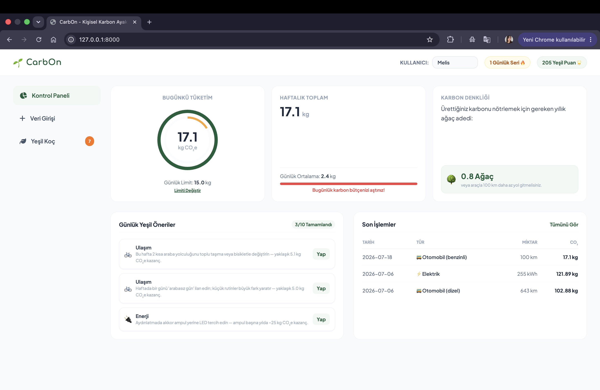
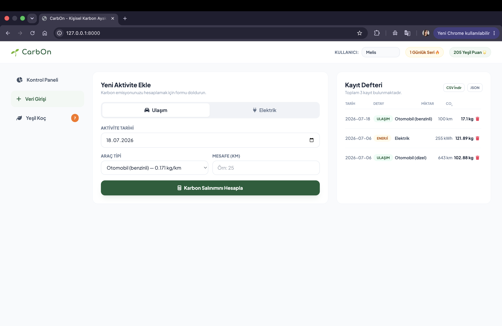
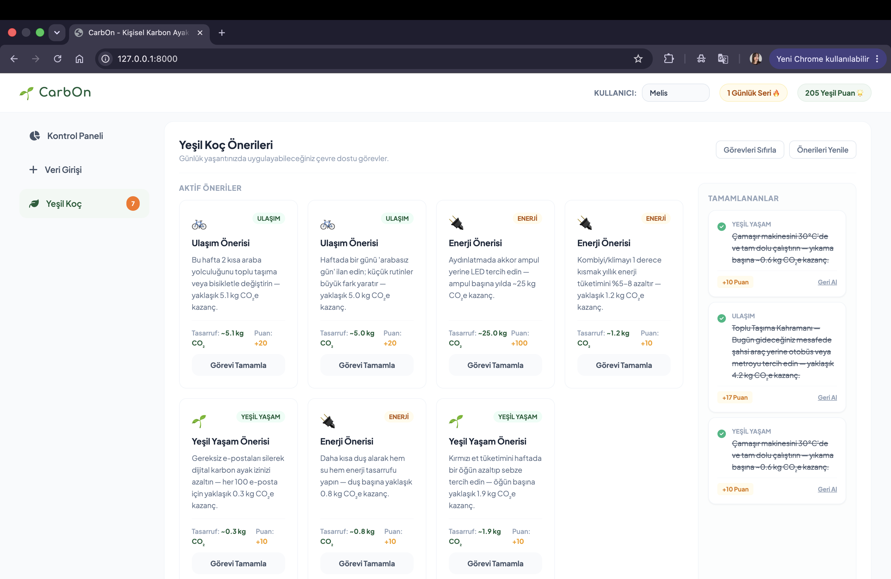

<b>Sprint Review</b>

 

* **Alınan Kararlar:**
  * Sprint 2'nin temel hedefi olan çalışan uygulama arayüzü başarıyla tamamlandı. Üç sayfa (Kontrol Paneli, Veri Girişi, Yeşil Koç) işlevsel hale getirildi. 
  * Tracking Agent karbon hesaplama algoritması backend ile bağlandı, Coach Agent LLM prompt mühendisliği kurularak kişiselleştirilmiş görev önerileri üretilebilir hale geldi. 
  * Gamification sistemi sprint ortasında ekip kararıyla eklendi ve hızla hayata geçirildi.
* **Bir Sonraki Sprint'e Aktarılan Kararlar:**
  * Kullanıcı kimlik doğrulama (authentication) sistemi Sprint 3'te eklenecek, kullanıcılar uygulamaya bireysel giriş yapabilecek.
  * Paylaşımlı yolculuk tasarruf hesabı ve Insight Agent haftalık trend analizi Sprint 3 kapsamında geliştirilecek.
* **Sprint Review Katılımcıları:** 
  * Melis Can, Eda Kaygulu, Rüya Sena Demirci, Furkan Emre İnce, Musa Barutcu.

<b>Sprint Retrospective</b>

 

* **Kazanımlar & Olumlu Yönler:**
  * Sprint 2'de somut ve çalışan bir ürün çıkardık ve bu gelişme ekip motivasyonunu ciddi ölçüde artırdı. Sprint 1'in araştırma ve planlama temeli bu sprintte daha planlı olmamızı sağladı.
  * Gamification sistemi sprint ortasında spontane bir ekip kararıyla eklendi ve başarıyla tamamlandı.
* **Geliştirilmesi Gereken Alanlar & Aksiyonlar:**
  * Frontend ve backend entegrasyonu beklediğimizden daha uzun sürdü. Sprint 3'te entegrasyon noktalarını sprint başında net tanımlamak ve ara kontrol toplantıları yapmak gerekiyor.
  * Sprint 3 kapsamı (authentication, paylaşımlı yolculuk, Insight Agent, deploy) net sınırlarla belirlendi, kapsam kaymasını önlemek için sprint başında önceliklendirme yapacağız.

# Sprint 3

<b>Sprint Review</b>

 

* **Alınan Kararlar:**
  * Sprint 3'ün temel hedefleri olan kullanıcı kimlik doğrulama, gelişmiş analitik modüller ve canlıya alma süreçleri başarıyla tamamlandı.
  * Kullanıcı kimlik doğrulama sistemi backend ve frontend tarafında entegre edilerek kullanıcıların uygulamaya güvenli bir şekilde giriş yapabilmesi sağlandı.
  * Insight Agent; haftalık CO₂ trend analizi, kategori bazlı emisyon kırılımı, Türkiye ortalaması ile karşılaştırmalı analizler ve LLM tabanlı otomatik özet metin üretimi yetenekleriyle tamamen işlevsel hale getirildi.
  * Uygulama canlı ortama deploy edilerek erişime açıldı.
* **Sprint Review Katılımcıları:** 
  * Melis Can, Eda Kaygulu, Rüya Sena Demirci, Furkan Emre İnce, Musa Barutcu.

<b>Sprint Retrospective</b>

 

* **Kazanımlar & Olumlu Yönler:**
  * Sprint 3'te hedeflediğimiz tüm teknik ve dokümantasyon süreçlerini zamanında tamamlayarak çalışan ürünü canlıya alabildik. Sprint 2'de yaşanan entegrasyon aksaklıklarından ders çıkarıldığı için bu sprintte frontend ve backend iletişimi çok daha akıcı ve hızlı yürütüldü.
  * Insight Agent'ın Türkiye ortalaması kıyaslaması ve LLM özet üretimi gibi detaylarının artırılması, ürünün sunduğu analitik değeri bir üst seviyeye taşıdı.
* **Geliştirilmesi Gereken Alanlar & Aksiyonlar:**
  * LLM prompt çıktılarının ve trend analizi algoritmalarının veri çeşitliliği arttıkça doğru bir biçimde çalışmaya devam etmesi için canlı ortamdaki kullanıcı verileriyle düzenli testler yapılması gerekiyor.
  * Canlıya alınan uygulamanın kullanıcı geri bildirimleri doğrultusunda performans takibinin yapılması ve olası hata izleme mekanizmalarının kurulması, sonraki süreç için temel aksiyon olarak belirlendi.

